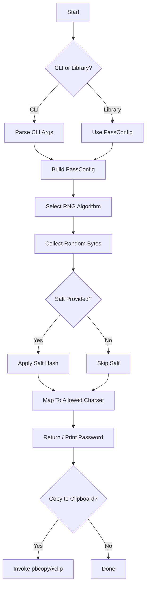

# gen_pass

Secure password generation **library** and **CLI** written in Rust.

[](https://codecov.io/gh/suenot/gen_pass_rs)

## Features

- Configurable password length and character sets (lowercase, uppercase, digits, symbols)
- Combines multiple entropy sources for strong randomness:
  - `rand::rngs::OsRng` (system entropy)
  - `rand_chacha::ChaCha20Rng` seeded from system entropy
  - `rand::rngs::StdRng` seeded with SHA-256 digest of previous random data
- Can be used as a library in your own Rust projects **or** as a standalone command-line tool.
- Optional clipboard copy (macOS `pbcopy`, Linux `xclip`).

## Installation

### As a Library

Add to your `Cargo.toml`:

```toml
[dependencies]
gen_pass = { git = "https://github.com/suenot/gen_pass_rs", tag = "v0.1.0" }
```

### As a CLI

```bash
# Clone and install
cargo install --path .

# Or install directly from crates.io (after publishing)
cargo install gen_pass
```

## Usage (CLI)

```bash
$ gen_pass --help
Generate secure passwords

Usage: gen_pass [OPTIONS]

Options:
  -l, --length <LENGTH>      Desired password length [default: 16]
      --lowercase <BOOL>     Include lowercase letters [default: true]
      --uppercase <BOOL>     Include uppercase letters [default: true]
      --digits <BOOL>        Include digits [default: true]
      --symbols <BOOL>       Include symbols [default: true]
      --safe-symbols <BOOL>  Use only basic shell-safe punctuation
                             (!@#$%*()_+-=) [default: false]
      --min-types <N>        Minimum distinct character types required
                             (uppercase/lowercase/digits/symbols) [default: 3]
  -s, --salt <SALT>          Salt string to modify password generation [default: "suenot"]
  -o, --output <OUTPUT>      Output format [default: plain] [possible values: plain, copy]
  -h, --help                 Print help info
  -V, --version              Print version info
```

Examples:

```bash
# 24-character password with all character sets
$ gen_pass -l 24

# 32-character password without symbols, copy to clipboard
$ gen_pass -l 32 --symbols=false -o copy

# Password with a custom salt for deterministic generation
$ gen_pass -l 20 -s "my-custom-salt"

# Default salt is "suenot" (author's nickname as an easter egg)
$ gen_pass -l 20

# Satisfy strict site rules (8-20 chars, at least 3 of the 4 character types).
# The default already guarantees >=3 distinct types.
$ gen_pass -l 12

# Require all four character types
$ gen_pass -l 16 --min-types 4

# Only basic, shell-safe punctuation (no \ ; ' < ~ | backtick)
$ gen_pass -l 20 --safe-symbols true
```

## Usage (Library)

```rust
use gen_pass::{PassConfig, PasswordGenerator};

fn main() -> anyhow::Result<()> {
    let cfg = PassConfig {
        length: 24,
        salt: Some("my-custom-salt".to_string()), // Custom salt (default is "suenot")
        ..Default::default()
    };

    let generator = PasswordGenerator::from_config(&cfg)?;
    let password = generator.generate(cfg.length);
    println!("{password}");
    Ok(())
}
```

### Algorithm Flow



### Supported Random Algorithms

| Name | Crate / Source | Crypto-secure | Complexity (1-10) | Notes |
|------|----------------|---------------|-------------------|-------|
| `mixed` (default) | `OsRng` + `ChaCha20Rng` + `StdRng` (SHA-256 seed) | ✔ | 10 | Multi-stage entropy mixing |
| `os` | `rand::rngs::OsRng` | ✔ | 9 | Direct system CSPRNG |
| `chacha20` | `rand_chacha::ChaCha20Rng` | ✔ | 9 | ChaCha20 stream cipher RNG |
| `hc128` | `rand_hc::Hc128Rng` | ✔ | 8 | HC-128 stream cipher RNG |
| `ring` | `ring::rand::SystemRandom` | ✔ | 9 | Implementation from *ring* crypto lib |
| `xoshiro` | `rand_xoshiro::Xoshiro256PlusPlus` | ✖ | 3 | Very fast, not cryptographically secure |
| `pcg64` | `rand_pcg::Pcg64Mcg` | ✖ | 3 | Permuted Congruential Generator |
| `rdrand` | `rdrand` crate (Intel HW) | ✔ | 8 | Uses CPU instruction `RDRAND` when available |

#### Algorithm Details

* **mixed** – Combines several independent entropy sources: the OS CSPRNG, a ChaCha20 stream cipher RNG seeded from that entropy, and finally `StdRng` re-seeded with SHA-256 of previous bytes. Enhances security through entropy mixing.
* **os** – Direct reading from the system cryptographically secure random number generator (`/dev/urandom`, `getrandom(2)`, `BCryptGenRandom`). Maximally reliable, but may be slower on certain platforms.
* **chacha20** – Implementation of ChaCha20 stream cipher RNG (IETF variant). Used in TLS and OpenSSH; provides high speed and cryptographic strength.
* **hc128** – HC-128 generator from the eSTREAM family. Offers an excellent speed/security ratio; suitable for embedded devices.
* **ring** – Wrapper over *ring* C code, uses system RNG and additionally checks for errors; convenient if the project already depends on `ring`.
* **xoshiro** – Xoshiro/Xoroshiro family (non-crypto). Very fast, small state. Not intended for passwords, but useful when pseudorandomness without crypto requirements is needed.
* **pcg64** – Permuted Congruential Generator 64-bit version. Good statistical properties, but not cryptographically secure.
* **rdrand** – Uses the Intel/AMD hardware instruction `RDRAND`. Fast, cryptographically secure, but only works on supported CPUs and depends on trust in microcode.

Select algorithm via CLI flag `-a/--algo`, or by setting `algorithm` field in `PassConfig`.

### Algorithm Diagrams

#### mixed

**Chain**: OsRng → ChaCha20Rng → SHA-256 → StdRng → Password bytes

#### os

**Chain**: OsRng / getrandom → Password bytes

#### chacha20

**Chain**: Seed via OsRng → ChaCha20Rng → Password bytes

#### hc128

**Chain**: Seed via OsRng → Hc128Rng → Password bytes

#### ring

**Chain**: ring::SystemRandom → Password bytes

#### xoshiro

**Chain**: Seed via OsRng → Xoshiro256++ → Password bytes

#### pcg64

**Chain**: Seed via OsRng → PCG64Mcg → Password bytes

#### rdrand

**Chain**: CPU RDRAND → Password bytes

## License

MIT
